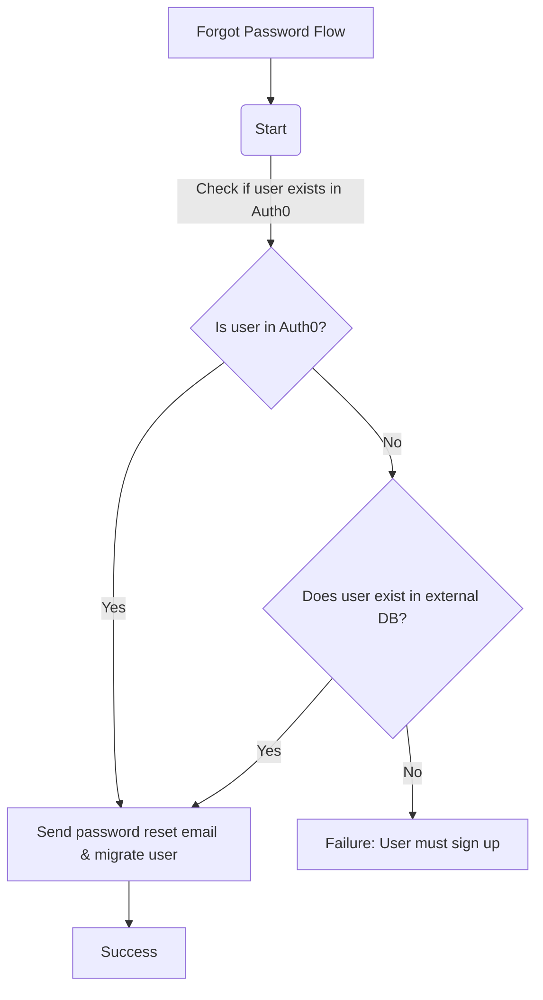

```mermaid
graph TD;
    %% Forgot Password Flow
    A[Forgot Password Flow] --> Start(Start)
    Start -->|Check if user exists in Auth0| UserInAuth0{Is user in Auth0?}
    UserInAuth0 -- Yes --> ResetEmail[Send password reset email & migrate user]
    UserInAuth0 -- No --> CheckExternalDB{Does user exist in external DB?}
    CheckExternalDB -- No --> Failure[Failure: User must sign up]
    CheckExternalDB -- Yes --> ResetEmail
    ResetEmail --> Success[Success]
```