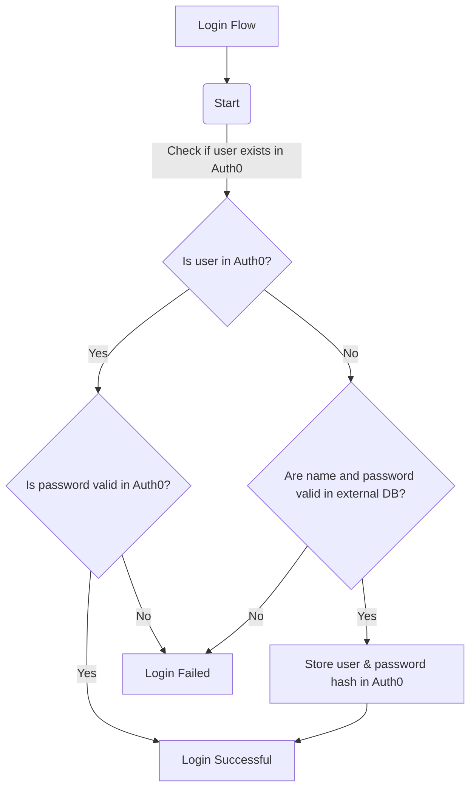

```mermaid
graph TD;
    %% Login Flow
    A[Login Flow] --> Start(Start)
    Start -->|Check if user exists in Auth0| UserInAuth0{Is user in Auth0?}
    
    UserInAuth0 -- Yes --> CheckPassword{Is password valid in Auth0?}
    CheckPassword -- Yes --> Success[Login Successful]
    CheckPassword -- No --> Failure[Login Failed]
    
    UserInAuth0 -- No --> CheckExternalDB{Are name and password valid in external DB?}
    CheckExternalDB -- No --> Failure
    CheckExternalDB -- Yes --> MigrateUser[Store user & password hash in Auth0]
    MigrateUser --> Success
```